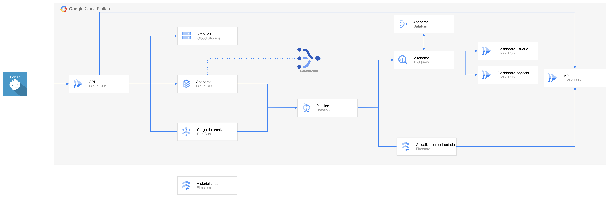

# AItonomo Pro 🧾

## Descripción del Proyecto

AItonomo Pro es una plataforma de gestión financiera diseñada para autónomos y freelancers. Combina las funcionalidades típicas de un software de facturación con inteligencia artificial integrada, permitiendo al usuario gestionar su negocio de forma más inteligente y automatizada.

La plataforma permite crear y enviar facturas y presupuestos en PDF, gestionar clientes y productos, y registrar gastos con foto del ticket. Todo esto se complementa con un conjunto de agentes de IA que automatizan tareas como la extracción de datos de tickets, el análisis de deducibilidad fiscal y la búsqueda de subvenciones disponibles para el perfil del usuario.

Además, AItonomo incluye un dashboard financiero en tiempo real con métricas de ingresos, gastos, IVA e IRPF estimado, y un dashboard de inversores con KPIs de crecimiento alimentado directamente desde la base de datos en BigQuery.

## Arquitectura



## Funcionalidades

### Gestión del negocio
- Crear y enviar **facturas y presupuestos en PDF** con numeración correlativa y cumplimiento VeriFactu
- Gestionar **clientes y productos/servicios**
- Registrar y categorizar **gastos con foto del ticket**
- **Calendario fiscal** con recordatorios automáticos de obligaciones (IVA trimestral, IRPF, etc.)

### Inteligencia Artificial

AItonomo integra varios agentes de IA construidos sobre Gemini 2.5 Flash y Vertex AI:

- **Extracción automática de tickets**: sube una foto de un ticket y la IA extrae proveedor, fecha e importe automáticamente, sin necesidad de introducir los datos manualmente.
- **Análisis de deducibilidad**: el agente evalúa si un gasto es deducible fiscalmente según el IAE del usuario, devolviendo un porcentaje de confianza y la referencia normativa aplicada (LIRPF, RIRPF).
- **Asesor de subvenciones**: busca subvenciones disponibles para el perfil del usuario (CNAE, provincia) usando una base de conocimiento vectorial actualizada automáticamente desde el BDNS mediante una Cloud Function.
- **Control por voz**: dicta facturas o gastos por voz y la IA los estructura y registra automáticamente.

### Analytics
- **Dashboard financiero** con métricas de ingresos, gastos, IVA a pagar e IRPF estimado, calculado en tiempo real desde PostgreSQL.
- **Dashboard de inversores** con KPIs de crecimiento mensual (nuevos usuarios, facturas generadas, volumen gestionado) alimentado desde BigQuery vía Datastream.

## Infraestructura en GCP

Todo el proyecto corre en Google Cloud Platform y se despliega automáticamente con Terraform. No hay configuración manual en la consola.

| Servicio | Para qué se usa |
|---|---|
| Cloud Run | Ejecuta el backend, el frontend y el dashboard |
| Cloud SQL (PostgreSQL) | Base de datos principal de la aplicación |
| BigQuery | Almacena datos analíticos para el dashboard de inversores |
| Datastream | Replica los datos de PostgreSQL a BigQuery en tiempo real |
| Cloud Storage | Guarda PDFs de facturas, fotos de tickets y avatares |
| Vertex AI RAG Engine | Base de conocimiento vectorial de subvenciones |
| Cloud Functions | Actualiza automáticamente la base de subvenciones desde el BDNS |
| Secret Manager | Guarda de forma segura las API keys y contraseñas |
| Pub/Sub | Cola de mensajes para procesar tickets en segundo plano |
| Artifact Registry | Almacena las imágenes Docker del proyecto |

## Estructura del proyecto

```
├── backend/              # Servidor API (FastAPI)
│   ├── agents/           # Agentes de IA (extracción, subvenciones, RAG)
│   ├── cloud_functions/  # Función automática de actualización de subvenciones (BDNS)
│   ├── setup/            # Scripts de configuración inicial y migración
│   ├── utils/            # Datos de referencia (CNAE, IAE)
│   ├── main.py           # Servidor principal con todos los endpoints
│   └── database.py       # Modelos de base de datos
├── static/               # Frontend web (HTML/JS/CSS)
├── dashboard-buss/       # Dashboard de inversores (React + Recharts)
├── dataflow/             # Pipeline de procesamiento de gastos en streaming
├── terraform/            # Infraestructura en GCP (todo automatizado)
└── docs/                 # Documentación, guías y recursos de diseño
```

## API del Backend (FastAPI)

El backend expone una API REST construida con FastAPI que gestiona toda la lógica de negocio de la aplicación. Incluye endpoints para autenticación, gestión de clientes, facturas, presupuestos, gastos, y todos los agentes de IA.

La API se conecta a Cloud SQL mediante el conector oficial de Google Cloud, y utiliza Secret Manager para gestionar las credenciales de forma segura. Los archivos (PDFs, tickets, avatares) se almacenan en Cloud Storage.

## Pipeline de Datos (Dataflow)

El pipeline de procesamiento de gastos está desarrollado en Apache Beam y se ejecuta en Google Cloud Dataflow. Consume mensajes de Pub/Sub cuando se sube un ticket, lo procesa con el agente de extracción de IA, y actualiza el gasto en la base de datos con los datos extraídos automáticamente.

## Replicación de Datos (Datastream)

Para mantener el dashboard de inversores actualizado sin afectar el rendimiento de la base de datos principal, se utiliza Google Cloud Datastream. Este servicio replica automáticamente los cambios de PostgreSQL a BigQuery en tiempo real mediante Change Data Capture (CDC).

## Cómo desplegar desde cero

### 1. Preparar GCP

```bash
# Autenticarse
gcloud auth login
gcloud auth application-default login

# Activar las APIs necesarias
gcloud services enable aiplatform.googleapis.com cloudfunctions.googleapis.com \
  cloudbuild.googleapis.com secretmanager.googleapis.com run.googleapis.com \
  artifactregistry.googleapis.com bigquery.googleapis.com datastream.googleapis.com \
  sqladmin.googleapis.com storage.googleapis.com pubsub.googleapis.com \
  dataflow.googleapis.com servicenetworking.googleapis.com vectorsearch.googleapis.com \
  --project=<PROJECT_ID>

# Crear el bucket donde Terraform guarda su estado
gsutil mb -p <PROJECT_ID> -l <REGION> gs://tfstate-aitonomo
```

### 2. Crear la base de conocimiento de subvenciones (una vez)

```bash
pip install google-cloud-aiplatform
python3 backend/setup/setup_rag_corpus.py
# Anotar el corpus_id que devuelve y ponerlo en terraform/terraform.tfvars
```

### 3. Configurar variables

Editar `terraform/terraform.tfvars`:

```hcl
project_id        = "<GCP_PROJECT_ID>"
region            = "<REGION>"
postgres_password = "<PASSWORD>"
database_url      = "postgresql://admin:<PASSWORD>@/aitonomo_db?host=/cloudsql/<PROJECT>:<REGION>:<INSTANCE>"
gemini_api_key    = "<GEMINI_API_KEY>"
rag_corpus_id     = "<RAG_CORPUS_ID>"
```

### 4. Desplegar con Terraform

```bash
cd terraform
terraform init
terraform apply
```

Terraform construye y sube las imágenes Docker, crea todos los servicios en GCP y despliega el backend, frontend y dashboard automáticamente.

### 5. Arrancar la replicación de datos

```bash
gcloud datastream streams update postgres-to-bq-stream \
  --location=<REGION> --project=<PROJECT_ID> --state=RUNNING
```

## Tecnologías principales

- **FastAPI** — Backend API REST
- **PostgreSQL + SQLAlchemy** — Base de datos y ORM
- **Gemini 2.5 Flash** — Modelo de IA para extracción, voz y asesoramiento fiscal
- **Vertex AI RAG Engine** — Base de conocimiento vectorial de subvenciones
- **React + Recharts** — Dashboard de inversores
- **Apache Beam** — Pipeline de procesamiento de gastos en streaming
- **Terraform** — Infraestructura como código

## Integrantes

- Carlos Sevillano
- Raúl Aragall
- Antonio Navarro
- David Fernández
- Germán Devis
- Marina López
